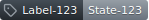

# Action Badge
[](https://github.com/DenoPlayground/Template-Action/actions/workflows/test_action.yml)

This Action creates SVG badges similar to the ones from GitHub.

The badges look like this:




## Usage

```yaml
jobs:
  generate-badge:
    name: 'Generate Badge'
    runs-on: ubuntu-24.04

    steps:
      - name: 'Generate'
        id: generate
        uses: loat-dev/action-badge@v1
        with:
          icon: 'tag'
          label-text: 'Label-123'
          state-text: 'State-123'

      - name: 'Write summary'
        run: |
          echo '# Generated Badge' >> $GITHUB_STEP_SUMMARY
          echo "" >> $GITHUB_STEP_SUMMARY
          echo "" >> $GITHUB_STEP_SUMMARY
          echo 'Open badge in new tab:' >> $GITHUB_STEP_SUMMARY
          echo -e '```url\ndata:image/svg+xml;utf8,${{ steps.generate.outputs.svg-text-encoded }}\n```' >> $GITHUB_STEP_SUMMARY
          echo "" >> $GITHUB_STEP_SUMMARY
          echo -e '```svg\n${{ steps.generate.outputs.svg-text }}\n```' >> $GITHUB_STEP_SUMMARY

```

### Inputs

| Input        | Required? | Default       | Description                                                      |
| :----------- | --------- | :------------ | :--------------------------------------------------------------- |
| `icon`       | No        | `mark-github` | Icon from [GitHub Octicons](https://github.com/primer/octicons). |
| `label-text` | No        | `Label`       | Text to use for the label.                                       |
| `state-text` | No        | `State`       | Text tu use for the state.                                       |

### Outputs

| Output             | Description                             |
| :----------------- | :-------------------------------------- |
| `svg-text`         | The generated SVG.                      |
| `svg-text-encoded` | The generated SVG encoded as valid URI. |

## License
The scripts and documentation in this project are released under the [GPLv3 License](./LICENSE).
